# tcbroker アーキテクチャ

## システム概要

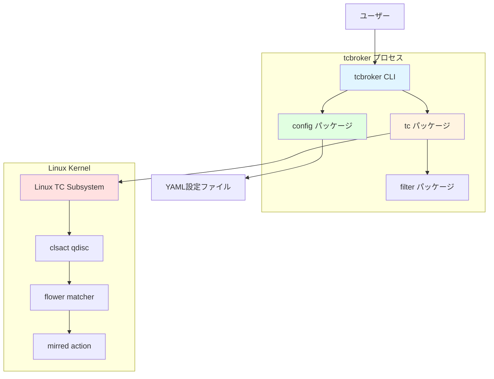
```mermaid
graph TB
    User[ユーザー] --> CLI[tcbroker CLI]
    CLI --> Config[config パッケージ]
    CLI --> TC[tc パッケージ]
    TC --> Linux[Linux TC Subsystem]
    Config --> YAML[YAML設定ファイル]

    subgraph "tcbroker プロセス"
        CLI
        Config
        TC
        Filter[filter パッケージ]
    end

    subgraph "Linux Kernel"
        Linux
        Qdisc[clsact qdisc]
        Flower[flower matcher]
        Mirred[mirred action]
    end

    TC --> Filter
    Linux --> Qdisc
    Qdisc --> Flower
    Flower --> Mirred

    style CLI fill:#e1f5ff
    style Linux fill:#ffe1e1
    style Config fill:#e1ffe1
    style TC fill:#fff4e1
```

## コマンドフロー

### start コマンド

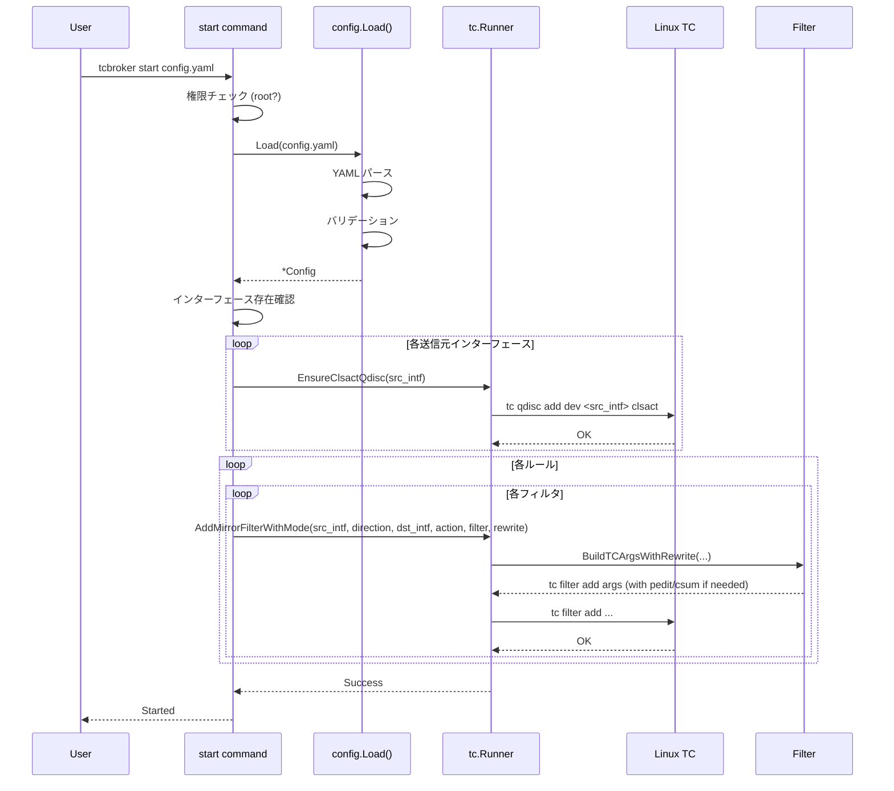
```mermaid
sequenceDiagram
    participant User
    participant CLI as start command
    participant Config as config.Load()
    participant TC as tc.Runner
    participant Kernel as Linux TC

    User->>CLI: tcbroker start config.yaml
    CLI->>CLI: 権限チェック (root?)
    CLI->>Config: Load(config.yaml)
    Config->>Config: YAML パース
    Config->>Config: バリデーション
    Config-->>CLI: *Config

    CLI->>CLI: インターフェース存在確認

    loop 各送信元インターフェース
        CLI->>TC: EnsureClsactQdisc(src_intf)
        TC->>Kernel: tc qdisc add dev <src_intf> clsact
        Kernel-->>TC: OK
    end

    loop 各ルール
        loop 各フィルタ
            CLI->>TC: AddMirrorFilterWithMode(src_intf, direction, dst_intf, action, filter, rewrite)
            TC->>Filter: BuildTCArgsWithRewrite(...)
            Filter-->>TC: tc filter add args (with pedit/csum if needed)
            TC->>Kernel: tc filter add ...
            Kernel-->>TC: OK
        end
    end

    TC-->>CLI: Success
    CLI-->>User: Started
```

### stop コマンド

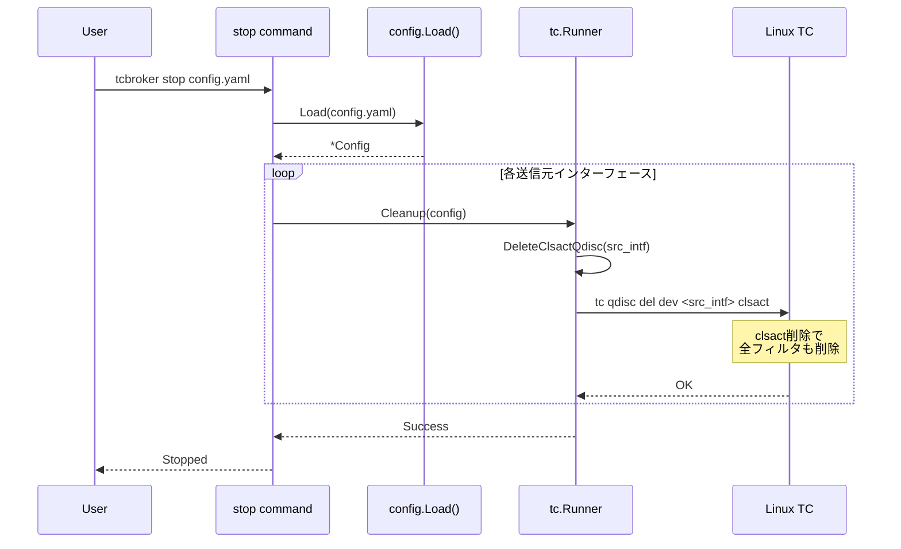
```mermaid
sequenceDiagram
    participant User
    participant CLI as stop command
    participant Config as config.Load()
    participant TC as tc.Runner
    participant Kernel as Linux TC

    User->>CLI: tcbroker stop config.yaml
    CLI->>Config: Load(config.yaml)
    Config-->>CLI: *Config

    loop 各送信元インターフェース
        CLI->>TC: Cleanup(config)
        TC->>TC: DeleteClsactQdisc(src_intf)
        TC->>Kernel: tc qdisc del dev <src_intf> clsact
        Note over Kernel: clsact削除で<br/>全フィルタも削除
        Kernel-->>TC: OK
    end

    TC-->>CLI: Success
    CLI-->>User: Stopped
```

### status コマンド

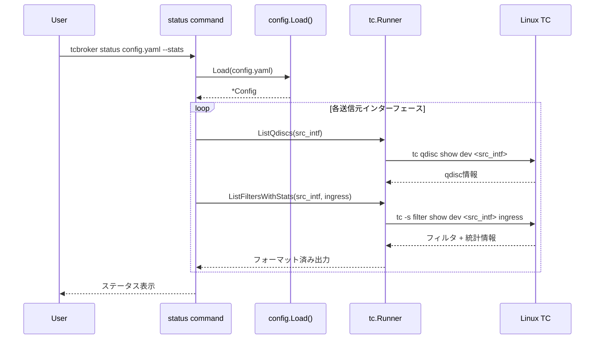
```mermaid
sequenceDiagram
    participant User
    participant CLI as status command
    participant Config as config.Load()
    participant TC as tc.Runner
    participant Kernel as Linux TC

    User->>CLI: tcbroker status config.yaml --stats
    CLI->>Config: Load(config.yaml)
    Config-->>CLI: *Config

    loop 各送信元インターフェース
        CLI->>TC: ListQdiscs(src_intf)
        TC->>Kernel: tc qdisc show dev <src_intf>
        Kernel-->>TC: qdisc情報

        CLI->>TC: ListFiltersWithStats(src_intf, ingress)
        TC->>Kernel: tc -s filter show dev <src_intf> ingress
        Kernel-->>TC: フィルタ + 統計情報

        TC-->>CLI: フォーマット済み出力
    end

    CLI-->>User: ステータス表示
```

## パッケージ構造

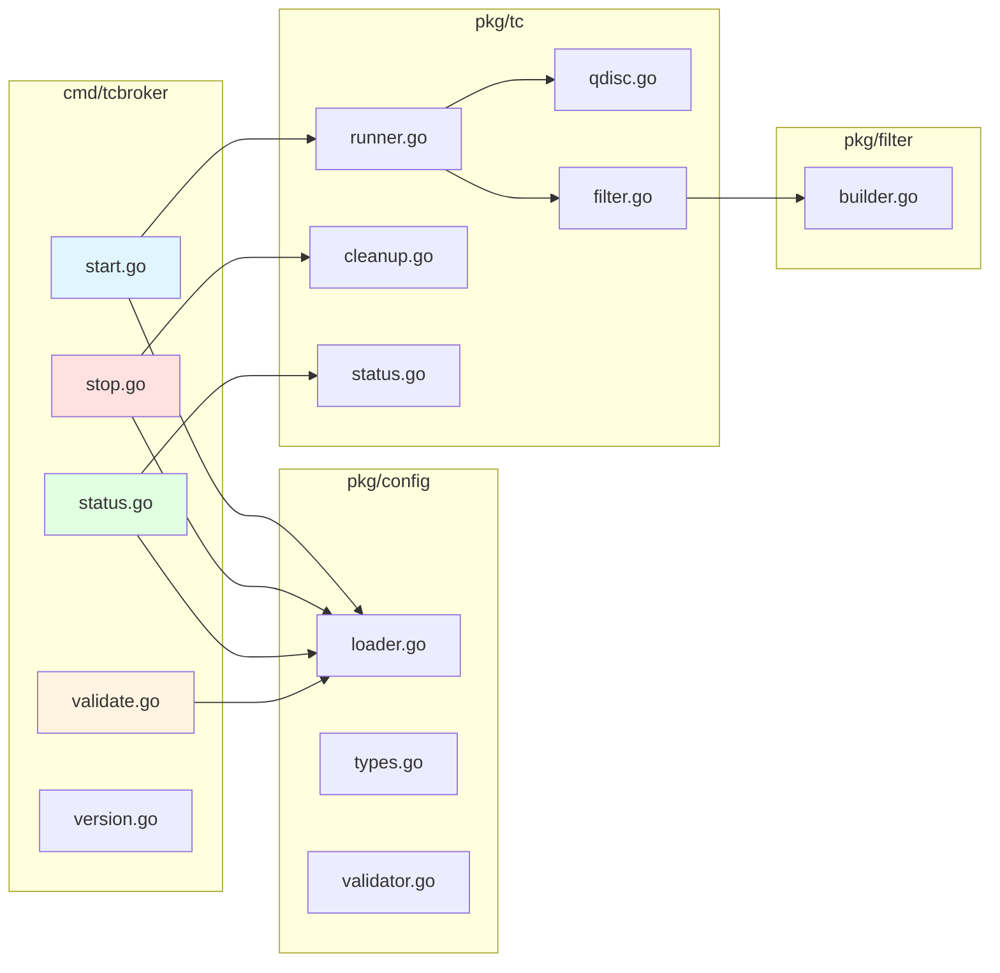
```mermaid
graph LR
    subgraph "cmd/tcbroker"
        Start[start.go]
        Stop[stop.go]
        Status[status.go]
        Validate[validate.go]
        Version[version.go]
    end

    subgraph "pkg/config"
        Loader[loader.go]
        Types[types.go]
        Validator[validator.go]
    end

    subgraph "pkg/tc"
        Runner[runner.go]
        Qdisc[qdisc.go]
        Filter[filter.go]
        Cleanup[cleanup.go]
        TCStatus[status.go]
    end

    subgraph "pkg/filter"
        Builder[builder.go]
    end

    Start --> Loader
    Start --> Runner
    Stop --> Loader
    Stop --> Cleanup
    Status --> Loader
    Status --> TCStatus
    Validate --> Loader

    Runner --> Qdisc
    Runner --> Filter
    Filter --> Builder

    style Start fill:#e1f5ff
    style Stop fill:#ffe1e1
    style Status fill:#e1ffe1
    style Validate fill:#fff4e1
```

## データフロー

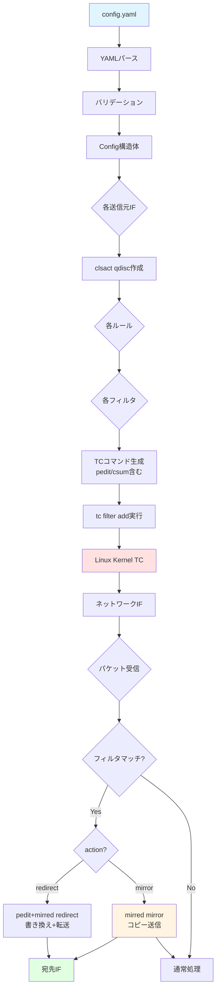
```mermaid
flowchart TB
    YAML[config.yaml] --> Parse[YAMLパース]
    Parse --> Validate[バリデーション]
    Validate --> Config[Config構造体]

    Config --> SrcIntfLoop{各送信元IF}

    SrcIntfLoop --> Qdisc[clsact qdisc作成]
    Qdisc --> RuleLoop{各ルール}

    RuleLoop --> FilterLoop{各フィルタ}
    FilterLoop --> Build[TCコマンド生成<br/>pedit/csum含む]
    Build --> Execute[tc filter add実行]

    Execute --> Kernel[Linux Kernel TC]
    Kernel --> NetIface[ネットワークIF]

    NetIface --> Ingress{パケット受信}
    Ingress --> Match{フィルタマッチ?}
    Match -->|Yes| CheckAction{action?}
    Match -->|No| Pass[通常処理]
    CheckAction -->|mirror| Mirror[mirred mirror<br/>コピー送信]
    CheckAction -->|redirect| Redirect[pedit+mirred redirect<br/>書き換え+転送]
    Mirror --> Target[宛先IF]
    Mirror --> Pass
    Redirect --> Target

    style YAML fill:#e1f5ff
    style Kernel fill:#ffe1e1
    style Mirror fill:#fff4e1
    style Target fill:#e1ffe1
```

## tc コマンド生成フロー

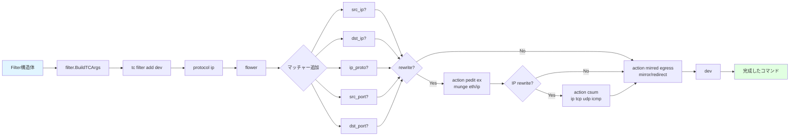
```mermaid
flowchart LR
    Filter[Filter構造体] --> Build[filter.BuildTCArgs]

    Build --> Base["tc filter add dev <iface> <hook>"]
    Base --> Proto[protocol ip]
    Proto --> Flower[flower]

    Flower --> Matchers{マッチャー追加}

    Matchers --> SrcIP[src_ip?]
    Matchers --> DstIP[dst_ip?]
    Matchers --> Protocol[ip_proto?]
    Matchers --> SrcPort[src_port?]
    Matchers --> DstPort[dst_port?]

    SrcIP --> CheckRewrite{rewrite?}
    DstIP --> CheckRewrite
    Protocol --> CheckRewrite
    SrcPort --> CheckRewrite
    DstPort --> CheckRewrite

    CheckRewrite -->|Yes| Pedit[action pedit ex<br/>munge eth/ip]
    CheckRewrite -->|No| Action

    Pedit --> Csum{IP rewrite?}
    Csum -->|Yes| CsumAction[action csum<br/>ip tcp udp icmp]
    Csum -->|No| Action

    CsumAction --> Action[action mirred egress<br/>mirror/redirect]
    Action --> Target["dev <dst_intf>"]
    Target --> Command[完成したコマンド]

    style Filter fill:#e1f5ff
    style Command fill:#e1ffe1
```

## エラーハンドリング

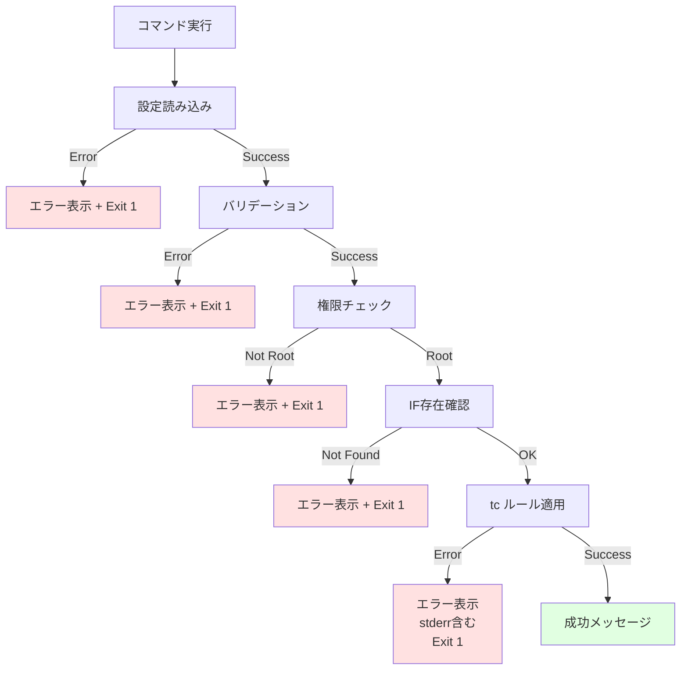
```mermaid
flowchart TB
    Start[コマンド実行] --> Load[設定読み込み]
    Load -->|Error| LoadErr[エラー表示 + Exit 1]
    Load -->|Success| Validate[バリデーション]

    Validate -->|Error| ValidateErr[エラー表示 + Exit 1]
    Validate -->|Success| PermCheck[権限チェック]

    PermCheck -->|Not Root| PermErr[エラー表示 + Exit 1]
    PermCheck -->|Root| IfaceCheck[IF存在確認]

    IfaceCheck -->|Not Found| IfaceErr[エラー表示 + Exit 1]
    IfaceCheck -->|OK| ApplyRules[tc ルール適用]

    ApplyRules -->|Error| TCErr[エラー表示<br/>stderr含む<br/>Exit 1]
    ApplyRules -->|Success| Success[成功メッセージ]

    style LoadErr fill:#ffe1e1
    style ValidateErr fill:#ffe1e1
    style PermErr fill:#ffe1e1
    style IfaceErr fill:#ffe1e1
    style TCErr fill:#ffe1e1
    style Success fill:#e1ffe1
```

## Linux TC階層構造

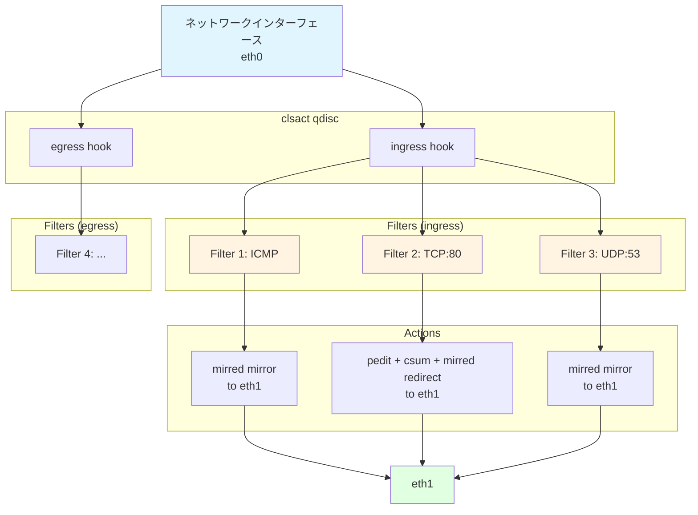
```mermaid
graph TB
    NIC[ネットワークインターフェース<br/>eth0]

    subgraph "clsact qdisc"
        Ingress[ingress hook]
        Egress[egress hook]
    end

    NIC --> Ingress
    NIC --> Egress

    subgraph "Filters (ingress)"
        F1[Filter 1: ICMP]
        F2[Filter 2: TCP:80]
        F3[Filter 3: UDP:53]
    end

    subgraph "Filters (egress)"
        F4[Filter 4: ...]
    end

    Ingress --> F1
    Ingress --> F2
    Ingress --> F3
    Egress --> F4

    subgraph "Actions"
        M1[mirred mirror<br/>to eth1]
        M2[pedit + csum + mirred redirect<br/>to eth1]
        M3[mirred mirror<br/>to eth1]
    end

    F1 --> M1
    F2 --> M2
    F3 --> M3

    M1 --> Target[eth1]
    M2 --> Target
    M3 --> Target

    style NIC fill:#e1f5ff
    style Target fill:#e1ffe1
    style F1 fill:#fff4e1
    style F2 fill:#fff4e1
    style F3 fill:#fff4e1
```

## Docker テスト環境

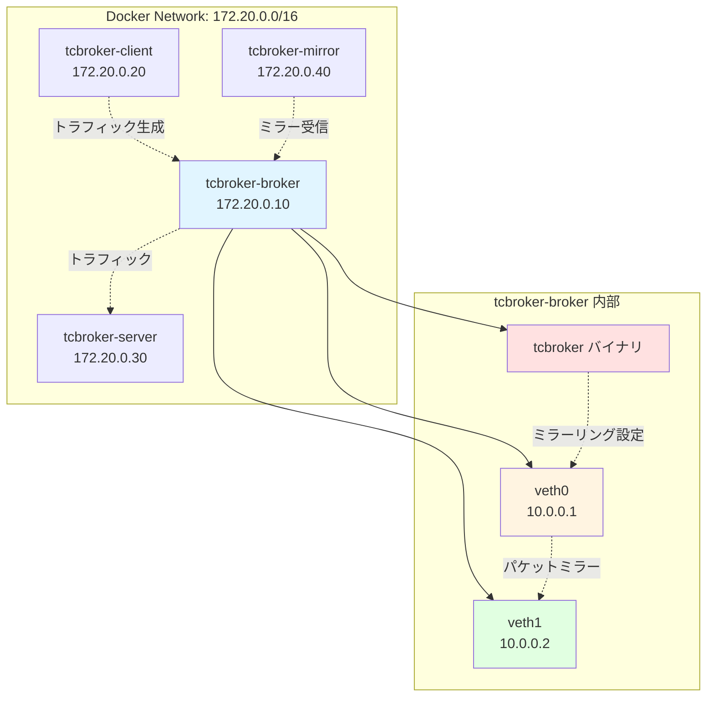
```mermaid
graph TB
    subgraph "Docker Network: 172.20.0.0/16"
        Test[tcbroker-broker<br/>172.20.0.10]
        Client[tcbroker-client<br/>172.20.0.20]
        Server[tcbroker-server<br/>172.20.0.30]
        Mirror[tcbroker-mirror<br/>172.20.0.40]
    end

    subgraph "tcbroker-broker 内部"
        Veth0[veth0<br/>10.0.0.1]
        Veth1[veth1<br/>10.0.0.2]
        TCBroker[tcbroker バイナリ]
    end

    Test --> Veth0
    Test --> Veth1
    Test --> TCBroker

    TCBroker -.ミラーリング設定.-> Veth0
    Veth0 -.パケットミラー.-> Veth1

    Client -.トラフィック生成.-> Test
    Test -.トラフィック.-> Server
    Mirror -.ミラー受信.-> Test

    style Test fill:#e1f5ff
    style Veth0 fill:#fff4e1
    style Veth1 fill:#e1ffe1
    style TCBroker fill:#ffe1e1
```

## CI/CD パイプライン

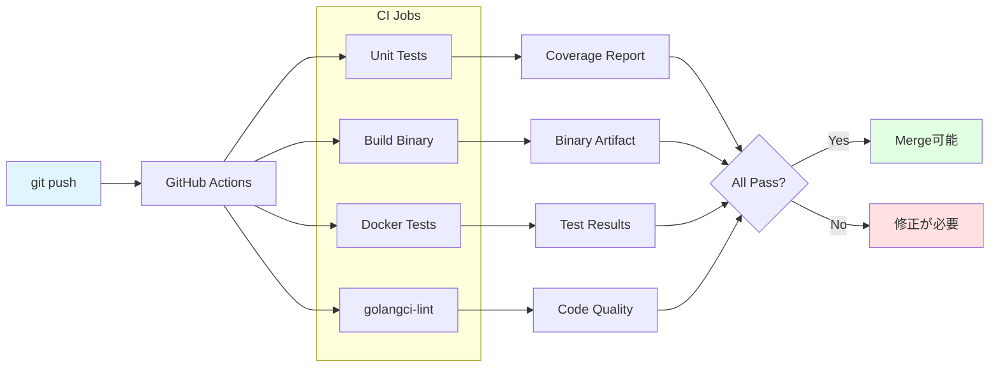
```mermaid
flowchart LR
    Push[git push] --> GHA[GitHub Actions]

    subgraph "CI Jobs"
        Test[Unit Tests]
        Build[Build Binary]
        Docker[Docker Tests]
        Lint[golangci-lint]
    end

    GHA --> Test
    GHA --> Build
    GHA --> Docker
    GHA --> Lint

    Test --> Coverage[Coverage Report]
    Build --> Artifact[Binary Artifact]
    Docker --> Results[Test Results]
    Lint --> Quality[Code Quality]

    Coverage --> Pass{All Pass?}
    Artifact --> Pass
    Results --> Pass
    Quality --> Pass

    Pass -->|Yes| Merge[Merge可能]
    Pass -->|No| Fail[修正が必要]

    style Push fill:#e1f5ff
    style Merge fill:#e1ffe1
    style Fail fill:#ffe1e1
```
